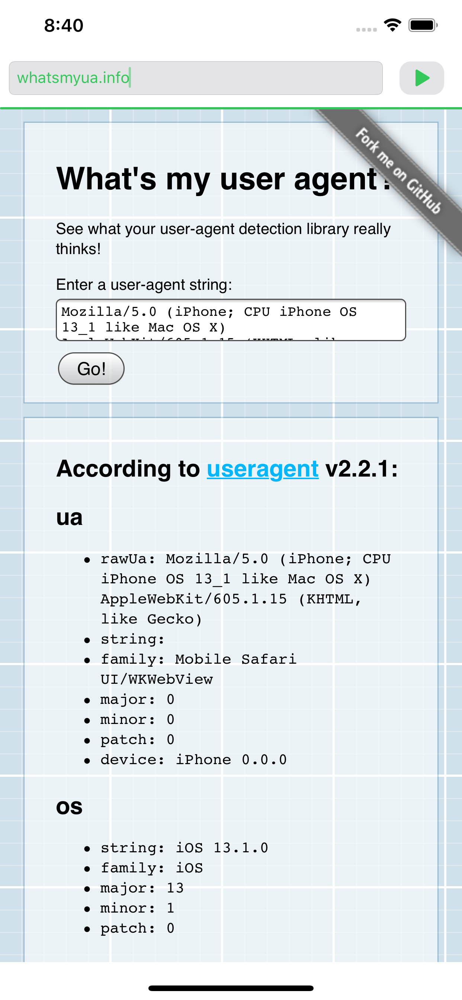

# webViewTester

## About

This is my first foray into ios development and is a simple app to wrap the [`WKWebView`](https://developer.apple.com/documentation/webkit/wkwebview) so it is possible to test how website look and behave in web view's inside 3rd party apps.

The aim is that I have a means to debug certain issues only seen when sites are viewed via [LinkedIn](https://www.linkedin.com), [Facebook](https://www.facebook.com) etc.

## Usage

Enter the URL in the input field and click go.

* If no URL is provided, it will fallback to and navigate to [https://www.example.com](https://www.example.com)
* If the schema is not provided in the URL, `https://` is prefixed.
* Navigation to `127.0.0.1` / `localhost` is supported.
